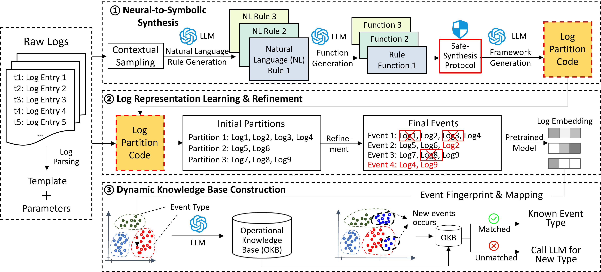

# LogNexus

**LogNexus: From Raw Streams to Operational Insights via Neural-Symbolic Event Reconstruction**



## 📖 Introduction

**LogNexus** is a hybrid **neural-symbolic framework** designed to resolve the conflict between semantic accuracy and operational efficiency in log event reconstruction. It transforms raw, interleaved log streams into actionable operational insights through a coarse-to-fine pipeline:

1.  **Neural-to-Symbolic Synthesis (Phase I):** An LLM acts as a code synthesis agent, generating deterministic, executable partitioning rules from diversity-sampled contexts. This decouples expensive reasoning from high-volume processing.
2.  **Log Representation Learning & Refinement (Phase II):** We introduce a specialized **Bi-Directional Mamba (Bi-Mamba)** encoder. This model captures long-range dependencies with linear computational complexity ($O(L)$), refining coarse partitions into precise event instances.
3.  **Dynamic Knowledge Base Construction (Phase III):** Refined events are incrementally clustered into an operational knowledge base, enabling real-time analysis and summarization.

Extensive evaluations on **OpenSSH**, **Linux**, and **Apache** datasets demonstrate that LogNexus achieves state-of-the-art performance (e.g., **ARI 1.0000** on OpenSSH), significantly outperforming statistical baselines and direct LLM approaches while reducing token costs by orders of magnitude.

## 📂 File Structure

```plaintext
LogNexus/
├── data/                   # Dataset storage (Raw logs & Ground truth)
├── cache/                  # Model checkpoints & Encoder artifacts
├── utils/                  # Utility functions (Config, LLM wrappers)
├── data_processing/        # Preprocessing scripts (Parsing, Encoding)
├── event_detector/         # Phase I: Rule synthesis & Coarse partitioning
├── event_refinement/       # Phase II: Bi-Mamba training & Event refinement
├── knowledge_base/         # Phase III: Dynamic clustering & KB construction
├── generated_processors/   # Synthesized Python scripts from Phase I
├── benchmark/              # Baseline methods implementation
├── ablation_experiments/   # Scripts for ablation studies
└── results/                # Evaluation metrics & Output logs
```

## 🛠️ Dependencies

LogNexus has been validated on **Ubuntu 20.04** with **Python 3.12.0**.

1. **Install Core Requirements:**

   ```bash
   pip install -r requirements.txt
   ```

2. **Configure LLM API:**
   Modify `utils/config.py` to set up your LLM provider (e.g., OpenAI, Gemini, DeepSeek).

   ```python
   # utils/config.py
   self.llm_api_key = os.getenv("LLM_PROXY_API_KEY", "your_actual_api_key")
   self.llm_model_name = "gemini-2.5-pro" # or gpt-4o, deepseek-chat
   self.llm_base_url = "https://api.example.com/v1"
   ```

## 📊 Datasets

We utilize datasets from [LogHub-2.0](https://github.com/logpai/Loghub-2.0). Due to licensing, please download the raw data manually and place it in the `./data` directory.

### Preparation Steps

1. Download `Apache.zip`, `Linux.zip`, and `OpenSSH.zip` from [Zenodo](https://zenodo.org/records/8275861).

2. Extract them into the `./data` folder.

3. Run the splitting script to generate training/testing sets according to our chronological protocol (6:1:3 ratio):

   ```bash
   cd ./data/
   python ./split_dataset.py
   ```

### Directory Layout (Example: Linux)

After splitting, the `./data` directory should look like this:

*   `Linux_train.log`: First 60% (Used for Sampling & Training)
*   `Linux_online_eval.log`: Middle 10% (Temporal Buffer)
*   `Linux_test.log`: Last 30% (Testing)
*   `Linux_test_label.log`: Ground truth labels for testing (Annotated via our guideline-based protocol).

## 🚀 Usage & Reproduction

### 1. Quick Start (Run LogNexus)

To run the full LogNexus pipeline on a specific dataset (default: Linux):

1. Set the target dataset in `utils/config.py` or via environment variable.

2. Run the main script:

   ```bash
   # This runs the 'full_model' mode by default
   cd ./abalation_experiments/
   python ./run_ablation.py
   ```

   *Note: If a synthesized processor does not exist in `./generated_processors`, the system will automatically trigger the LLM to generate one.*

### 2. Ablation Studies

To reproduce the ablation study results presented in the paper (Table 4 & 6), use the provided shell script. This will run 5 iterations for stability analysis.

1. Edit `ablation_experiments/run_ablation.sh` to select the dataset:

   ```bash
   export DATASET_NAME="Linux"
   ```

2. Execute the script:

   ```bash
   cd ./ablation_experiments/
   bash ./run_ablation.sh
   ```

3. Generate the summary report (CSV):

   ```bash
   cd ./generated_processors/
   python ./eval.py
   ```

   *Output Example:*

   ```csv
   Mode, ARI, NMI, Inference Time (ms), ...
   full_model, 0.9190±0.02, 0.9854±0.006, 409.54, ...
   no_refinement, 0.8869±0.06, 0.9722±0.019, 0.00, ...
   ```

### 3. Knowledge Base Evaluation

To evaluate the quality of the constructed Operational Knowledge Base (Phase III):

```bash
python ./knowledge_base/kb_evaluator.py
```

*   **Metrics:** Event Type Discovery Accuracy (ETDA), Event Classification Accuracy (ECA).
*   **Note:** If you wish to rebuild the KB from scratch, run `knowledge_base_builder.py`. *Warning: This requires re-annotating the semantic correctness of newly discovered event types.*

### 4. Baselines Comparison

To run baseline methods (DeepCASE, TF-IDF, Direct LLM, etc.):

```bash
cd ./benchmark/
python ./benchmark/run_benchmarks.py --methods llm_knowledge deepcase traditional
```

*   Available methods: `traditional`, `deepcase`, `pretrained`, `llm_naive`, `llm_knowledge`, `llm_cot`.